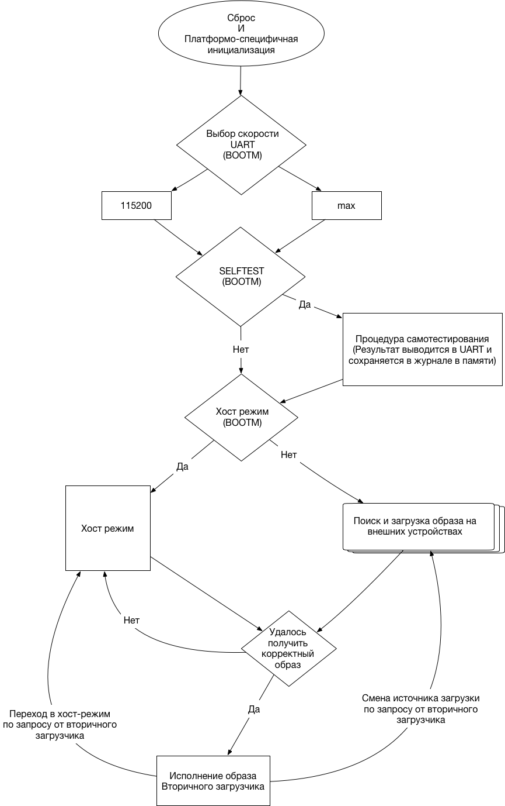

RumBoot - универсальный расширяемый загрузчик для СБИС СнК.

# Руководство пользователя

Эта часть документа содержит общую информацию о ROM-загрузчике RumBoot.

## Процесс загрузки

### Выводы микросхемы настраивающие последовательность загрузки

Поведение первичного загрузчика определяется BOOTM выводами микросхемы. Значение выводов считывается в самом начале загрузки. В общем случае загрузчик использует три bootstrap вывода, которое в случае необходимости можно сократить до одного (host mode):

- **Selftest (BOOTM0)** Вывод выбирает выполнять ли процедуру самотестирования при старте микросхемы. 0 - Не выполнять, 1 - выполнять.

- **Host (BOOTM1)** Вывод включает принудительную загрузку в Host-режиме . 0 - Не задействовать, 1 - задействовать. Подробнее см. (раздел Host-режим)

- **Uart Speed (BOOTM2)** Выбор начальной скорости последовательного порта, используемого для вывода отладочных сообщений. 0 - 115200, 1 - максимально возможная скорость (зависит от СБИС).


Возможно добавление других выводов, специфичных для конкретной микросхемы. Точные номера выводов, настраивающие режимы, а так же использующиеся для сигналов SDIO Card Detect и SPI Chip Select приведены в документации на соответствующую микросхему.

При старте, загрузчик выводит в последовательный порт диагностическую информацию, в т.ч.  git ревизию, из которой производилась сборка, тип сборки (Debug/Production), кодовое имя платформы и декодированные значения bootstrap выводов.   

Пример:

```
    RC Module's          __                __
   _______  ______ ___  / /_  ____  ____  / /_
  / ___/ / / / __ `__ \/ __ \/ __ \/ __ \/ __/
 / /  / /_/ / / / / / / /_/ / /_/ / /_/ / /_  
/_/   \__,_/_/ /_/ /_/_.___/\____/\____/\__/  
basis | Debug | master-60e4021
--- RumBoot Configuration ---
Force Host Mode: disabled
Selftest:        disabled
UART speed:      115200 bps
---          ---          ---
```

### Последовательность загрузки

Диаграмма, описывающая схематично процесс загрузки приведена на рисунке ниже.
Детальное описание отдельных этапов будет приведено далее по тексту.  

<div style="page-break-after: always;"></div>


Первичный загрузчик предусматривает два режима работы:

- Нормальная загрузка (с переходом в хост-режим, если загрузка не удалась или по запросу от вторичного загрузчика)
- Принудительная загрузка в хост режиме

Во всех сценариях загрузки код вторичного загрузчика размещается в внутренней
SRAM памяти СБИС, где и проходит валидацию перед выполнением.

## Приоритет выбора устройств для загрузки

Приоритет выбора устройств для загрузки определяется на этапе компиляции ROM загрузчика и специфичен для проекта СБИС.

Общий список доступных плагинов для источников загрузки и их статус приведен в таблице ниже.

Плагин                | Где используется       | Состояние
--------------------- | ---------------------- | ---------
SPI Flash (PL022 SPI) | basis, oi10            | Готов
SDIO                  | basis, mpw-proto, oi10 | Готов
I2C (RCM) EEPROM      | basis                  | Готов
physmap (NOR EMI)     | oi10                   | Готов
file                  | native                 | Готов

Общие принципы, по которым формируется список загрузки СБИС.

- Устройства со сменными носителями (напр. SD карта), имеют больший приоритет при загрузке. Таким образом исключается ситуация, когда прошивка несъемного накопителя (например, spi flash, nor) приводит к неработоспособности системы и для восстановления функциональности платы требуется использование специальных средств (jtag, edcltool, etc.), которые могут быть в данный момент недоступны или демонтаж накопителя для перепрошивки через программатор.

- Перед попыткой использовать устройство для загрузки, всегда проводится максимально быстрая попытка проверки наличия накопителя. Для SD карты - проверка сигнала Card Detect через GPIO, для I2C EEPROM - проверка начального состояния линий SDA/SCL (должны быть в 1).

- При наличии специальных требований по времени загрузки с определенных накопителей, они могут быть перенесены в самое начало списка.

## Структура заголовка образов вторичного загрузчика

Образ вторичного загрузчика снабжается служебным заголовком, приведенным на Листинге ниже. Заголовок позволяет загрузчику провести проверку целостности данных образа вторичного загрузчика и базовую проверку совместимости образа и СБИС. Текущая версия заголовка (2) расчитана для 32х-битных систем, потому
для всех указателей используются поля по 32 бита.

```c
struct __attribute__((packed)) rumboot_bootheader {
    uint32_t magic;
    uint8_t  version;
    uint8_t  reserved;
    uint8_t  chip_id;
    uint8_t  chip_rev;
    uint32_t data_crc32;
    uint32_t datalen;
    uint32_t entry_point[10];
    uint32_t header_crc32;
    const struct rumboot_bootsource *device;
    char     data[];
};
```

Заголовок используется первичным загрузчиком для выполнения следующих действий:

  - Проведение базовой проверки совместимости образа вторичного загрузчика и микросхемы на основе анализа полей version, chip_id, chip_rev;
  - Проведение проверки целостности заголовка и образа исполняемого кода вторичного загрузчика на основе контрольных сумм, указанных в полях header_crc32 и header_crc32.

Ниже приведено детальное описание полей заголовка образа

- **magic** - служебное слово (0xb01dface), идентифицирующее начало корректного заголовка. По порядку байт этого поля утилита для подготовки образов вторичного загрузчика определяет целевой порядок байт. При отсутствии корректного ключевого слова образ не будет загружен.  

- **version** - Версия заголовка. На данный момент 2. В случае неправильного значения этого поля образ не пройдет валидацию загрузчиком.

- **reserved** - Поле зарезервиновано.

- **chip_id** - Идентификатор микросхемы (порядковый номер). Если идентификатор не совпадает, то образ считается невалидным и не будет исполнен. Текущая таблица идентификаторов приведена в Приложении А.

- **chip_rev** - Идентификатор ревизии микросхемы, если выпущено более одной ревизии. Начинается с 1. Несовпадение номера ревизии с ожидаемым вызывает предупреждение в журнале в загрузки.

- **data_crc32** - CRC32 контрольная сумма для данных образа. Подробная информация об алгоритме будет приведена далее.

- **datalen** - Длина данных в байтах

- **entry_point[10]** - Заголовком предусмотрено до 10 точек входа. Реально используются только первые N элементов, где N равно количеству процессорных ядер в системе. Первичное процессорное ядро (ядро, выполняющее загрузку системы) использует нулевой элемент в виде точки входа во вторичный загрузчик. Вторичные ядра (если присутствуют) используют элемент массива, соответствующий своему номеру в системе в виде точки входа. Максимальное возможное количество процессорных ядер в заголовке выбрано для выравнивания заголовка по размеру 64 байта. Каждая точка входа может проходить специфичную для данной СБИС валидацию перед использованием (Напр. доступность этого адреса в TLB для PowerPC). В случае, если валидация точки входа вторичного не проходит успешно, выводится предупреждение, ядро не задействуется. Если первичная точка входа не проходит валидацию, то образ считается некорректным.

- **header_crc32** - CRC32 контрольная сумма всех полей заголовка идущих до данного поля.

- **struct rumboot_bootsource *device** - ячейка резервируется в образе и исключается из проверки контрольными суммами. В случае успешной загрузки во внутреннюю SRAM память и успешную валидацию, сюда будет записан указатель на структуру устройства, с которого была выполнена загрузка. В случае загрузки с host'а в этом поле будет NULL. В дальнейшем поля структуры bootsource можно использовать для считывания дополнительных данных с устройства, откуда была произведена загрузка.

## Расчет контрольной суммы

Используется релизация CRC-32-IEEE 802.3 с полиномом X^32+X^26+X^23+X^22+X^16+X^12+X^11+X^10+X^8+X^7+X^5+X^4+X^2+X^1+X^0

Реализация доступна, например, из языка python (версия 3)
```python

import binascii
crc32 = binascii.crc32(data)
```
Для подготовки образов расчета контрольных сумм предлагается готовая утилита на языке python (rumboot-packimage.py)

## Процедура формирования образов вторичного загрузчика

Образ вторичного загрузчика формируется в четыре стадии

- На этапе компиляции заголовок образа определяется со всеми полями, кроме контрльных сумм и помещается в виде структуры в отдельную секцию.

Пример bootheader.c, который должен быть частью проекта вторичного загрузчика.

```c
#include <stdint.h>
#include <rumboot/boot.h>
#include <rumboot/platform.h>

extern void rumboot_main();
extern int main();

static const __attribute__((used)) __attribute__((section(".header")))
struct rumboot_bootheader hdr = {
    .magic        = RUMBOOT_HEADER_MAGIC,
    .version    = RUMBOOT_HEADER_VERSION,
    .chip_id    = RUMBOOT_PLATFORM_CHIPID,
    .chip_rev    = RUMBOOT_PLATFORM_CHIPREV,
    .entry_point    = {
        (uint32_t)&main,
    }
};
```

- На этапе компоновки сценарий компановщика размещает секцию с заголовком в самом начале файла. Пример минимального ld сценария приведен ниже.

```lds
OUTPUT_ARCH(ARM)
MEMORY
{
    IM0 (rwx): ORIGIN = 0x40000, LENGTH = 0x40000
}

SECTIONS
{

 .header : {
   KEEP(*(.header))
 } > IM0

 .rwx : {
  *(.text)
  *(.text.*)
  *(.rodata)
  *(.data)
  } > IM0

}
```

- После компановки из полученного файла в формате elf стандартными средствами компилятора генерируется .bin файл. Например:

```
arm-rcm-eabihf-objcopy --gap-fill 0x00 -O binary hello_world hello_world.bin
```

- После вышеуказанных действий утилита rumboot-packimage.py производит расчет и запись контрольных сумм в заголовке образа. Пример работы данной утилиты приведен ниже.

```
rumboot_packimage.py -f rumboot-basis-Debug-spl.bin -c
Wrote valid checksums to image header
=== RumBootV2 Header Information ===
Endianess:              little
Magic:                  0xb01dface
Header Version:         0x2
Chip ID:                0x3
Chip Revision:          0x1
Data Length:            380
Header CRC32:           0x7e2fc690 [Valid]
Data CRC32:             0x7824b25a [Valid]
```

## Формат указателя на точку входа

Точка входа в образ вторичного загрузчика имеет следующий формат.

```
int main();
```

Переход на точку входа выполняется как вызов функции, а не безусловный переход.
Это позволяет после исполнения кода вторичного загрузчика вернуться в ROM и загрузить следующий бинарный файл или провести загрузку с другого источника.

## Последовательное исполнение кода из нескольких источников

Первичный загрузчик поддерживает последовательное исполнение кода одного или нескольких источников, в случае если после исполнения кода вторичного загрузчика был произведен возврат в код ROM с соответсющем кодом завершения.

После вызова загрузчиком и исполения этой функции, дальнейшее поведение зависит от возвращаемого этой функцией значения.

- \> 0 - Принудительная загрузка с источника номер N-1 (Если N больше количества доступных источников - переход в хост-режим)

- =0 - Продолжить цепочку загрузки с этого или следуюего источника

- -9 - принудительный переход в хост-режим (-EBADSOURCE)

- <-1 - Продолжить цепочку загрузки со следующего источника

## Последовательное исполнение нескольких образов вторичного загрузчика

Несколько корректных образов вторичного загрузчика можно записать последовательно. В случае, если после исполнения кода первого экземпляра вторичного загрузчика был возврат в rom с кодом 0, из этого же источника будет загружен следующий образ и (в случае успешного прохождения процедуры валидации) исполнен.

Если устройство загрузки требует доступа с фиксированным размером блока, то следующий загружаемый образ должен находиться в начале следующего блока.

Пример: SD карта памяти. Размер блока 512 байт. Первый образ загружается с офсета 8192 байт и занимает 1467 байт (включая заголовок).

Как видно из выражения, (8192 + 1467) % 512 = 443, конец первого образа вторичного загрузчика не выровнен по границе блока. Таким образом, пыпытка загрузки следующего образа с данного устройства будет проводиться с офсета:  

(8192 + 1467) + (512 - 443) = 9728


## Использование указателя bootsrc для чтения дополнительных данных с загрузочного устройства из вторичного загрузчика

При успешной загрузке с ПЗУ и передачи управления вторичному загрузчику поле bootsrc заголовка устанавливается на указатель струтруры, описывающий порядок доступа к данному устройству. Данная структура содержит указатели на функции в ROM, которые могут использоваться для чтения дополнительных данных из этого устройства.

Предоставляемый API:

```c
bool bootsource_init(const struct rumboot_bootsource *src, void *pdata);
size_t bootsource_read(const struct rumboot_bootsource *src, void *pdata, void *dest, size_t offset, size_t len);
void bootsource_deinit(const struct rumboot_bootsource *src, void *pdata);
```

(Подробнее см. исходный код)

## Хост-режим загрузки

Хост-режим - это специальный режим загрузки, который предназначен для обновления ПО.

В этом режиме загружаемый образ вторичного загрузчика может
быть размещен в накристальной памяти используя пассивный или активный метод.

К пассивным относится загрузка по интерфейсам JTAG, EDCL или Spacewire RMAP (если присутствуют). Загрузка по этим интерфейсам не требует конфигурации, загрузчик просто опрашивает периодически соответствующую область памяти.

К активному режиму относится загрузка по протоколу xmodem поверх UART или любому другому, который требует соответствующей реализации в составе bootrom.

Плагины, обеспечивающие загрузку в активном режиме можно выбирать на этапе компиляции загрузчика.

Плагин                  | Проект      | Статус
----------------------- | ----------- | -----------------
Командная строка (UART) | basis, oi10 | Минимальный режим
xmodem (UART)           | basis, oi10 | Готов

В host режиме, при успешной загрузке поле bootsrc устанавливается в NULL.

В случае ошибки при валидации загружаемого образа загрузчик выводит диагностическое сообщение в UART, а так же переписывает поле magic кодом ошибки. Список возможных ошибок приведен ниже.

Имя в коде загрузчика | Код ошибки | Описание
--------------------- | ---------- | ---------------------------------------------------------------------
EBADMAGIC             | 1          | Неправильное поле magic
EBADVERSION           | 2          | Несовпадение версии заголовка
EBADHDRCRC            | 3          | Ошибка в контрольной сумме заголовка
EBADCHIPID            | 4          | Несовместимый chip id
EBADENTRY             | 5          | Точка входа первичного ядра не прошла процедуру валидации
EBADHEADER            | 6          | Ошибка в заголовке. Все ошибки заголовка имеют код меньше этого числа
EBADDATACRC           | 7          | Ошибка при проверки контрольной суммы данных
ETOOBIG               | 8          | Размер данных привышает доступный для SPL размер встроенного ОЗУ

При загрузке по интерфейсу edcl/rmap/jtag для избежания преждевременной попытки валидации образа рекомендуется:

- Загрузить данные, начиная с 4го байта и до конца образа
- Установить magic (первые 4 байта) в валидное значение


### Интерфейс командной строки

Интерфейс командной строки доступен в хост режиме и позволяет:

- Вызывать индивидуальные компоненты процедуры самотестирования

- Выполнить загрузку с указанного устройства

- Вывести информацию о версии загрузчика

- Вызвать загрузку и исполнения файла по протоколу xmodem

- Писать/читать память

Можно расширять интерфейс командной строки дополнительными командами, по мере
необходимости.

# Приложение А: Таблица идентификаторов ChipID
Платформа   | Part Number             | Endianess | #Cores | ChipID | ChipRev | RumBoot |
----------- | ----------------------- | --------- | ------ | ------ | ------- | ------- |
mm7705*     | 1888ТХ018               | big       | 2      | 1      | 1       | V1      |
mb7707*     | К1879ХБ1Я               | little    | 1      | 2      | 1       | legacy  |
Базис       | 1888ВС048               | little    | 1      | 3      | 1       | V2      |
ОИ-10       | 1888ВМ018(A)/1888ВМ01H4 | big       | 1      | 4      | 1       | V2      |
BBP3        | 1888ВС058               | little    | 1 + 2  | 5      | 1       | V2      |
nm6408*     | 1879ВМ8Я                | little    | 16+5   | 6      | 1       | legacy  |
O32T        | 1888ВМ018(A)/1888ВМ01H4 | big       | 1+1    | 7      | 1       | V3      |


# Приложение В: Приоритет загрузки для разных микросхем

## basis (1888ВС048)

Источник | CS/CD/Slave Addr     | Комментарий
-------- | -------------------- | ---------------------------------------
SDIO_0   | Card Detect: GPIO0_3 | Чтение первого образа идет с офсета 8Кб
SPI_0    | CS: Internal         |
SPI_0    | CS: GPIO0_5          |
I2C_0    | EEPROM @ 0x80        |
I2C_0    | EEPROM @ 0x81        |
I2C_0    | EEPROM @ 0x82        |
I2C_0    | EEPROM @ 0x83        |
SDIO_1   | Card Detect: GPIO0_4 | Чтение первого образа идет с офсета 8Кб

## oi10

Источник | CS/CD/Slave Addr     | Комментарий
-------- | -------------------- | ----------------------------------------------------------
SDIO_0   | Card Detect: GPIO0_3 | Чтение первого образа идет с офсета 8Кб
NOR      | CS: 5                |
SPI_0    | CS: internal         |

## bbp3

Выбор источника на этой платформе определяется дополнительными выводами BOOTM. 
см. документацию по микросхеме

Источник | CS/CD/Slave Addr     | Комментарий
-------- | -------------------- | ----------------------------------------------------------
SPIO0    | SPI0 (CS: GPE0)      | 
NOR (EMI)|                      |
